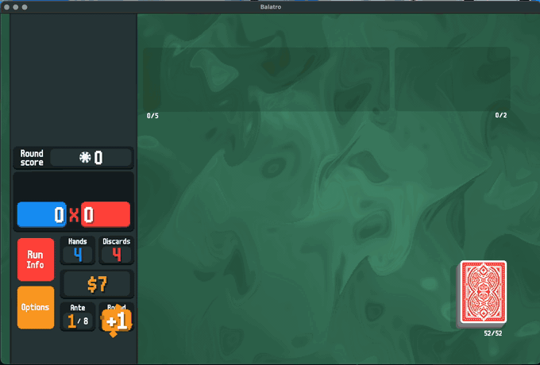
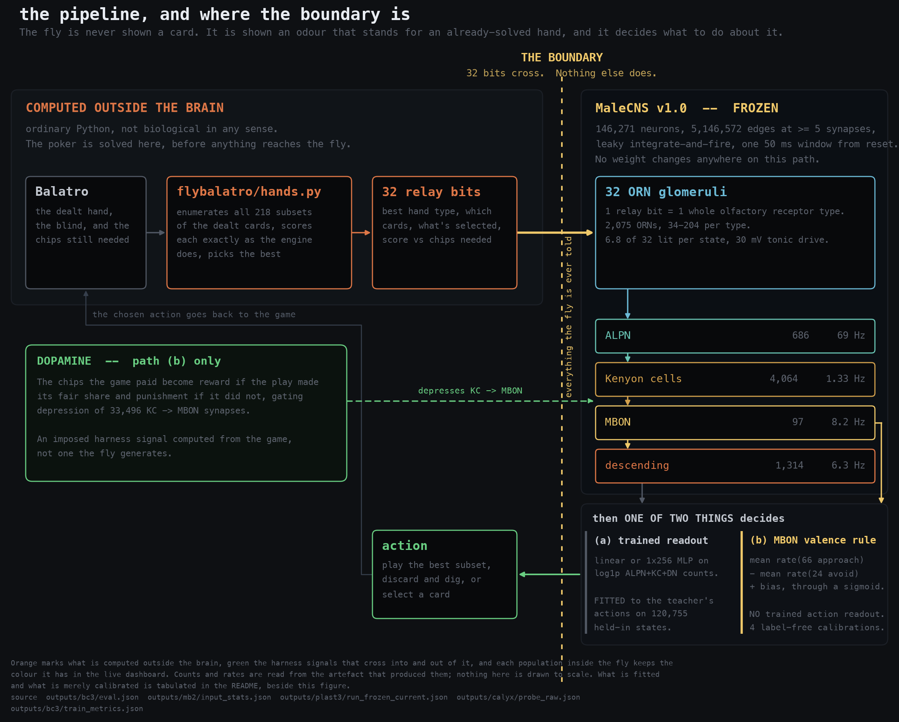
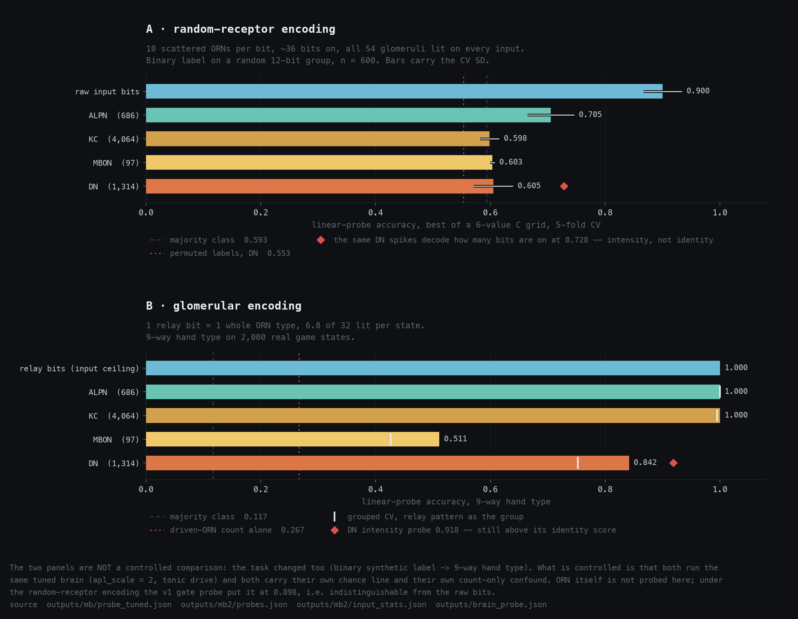
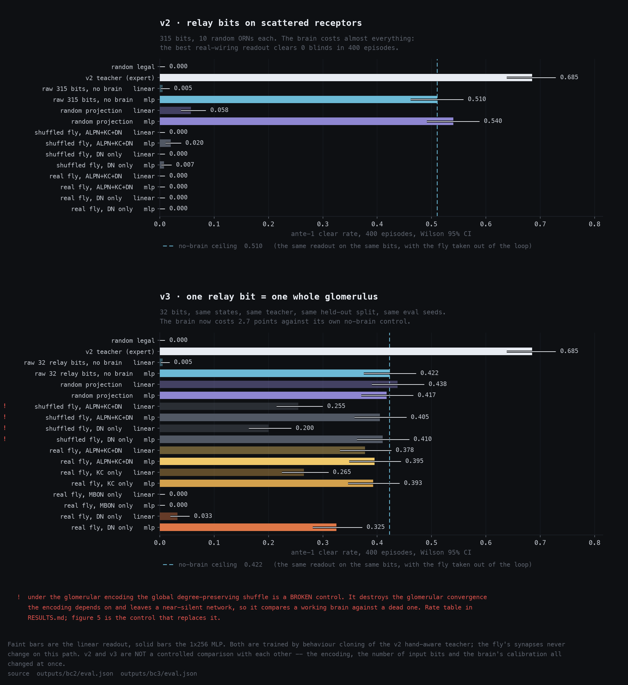
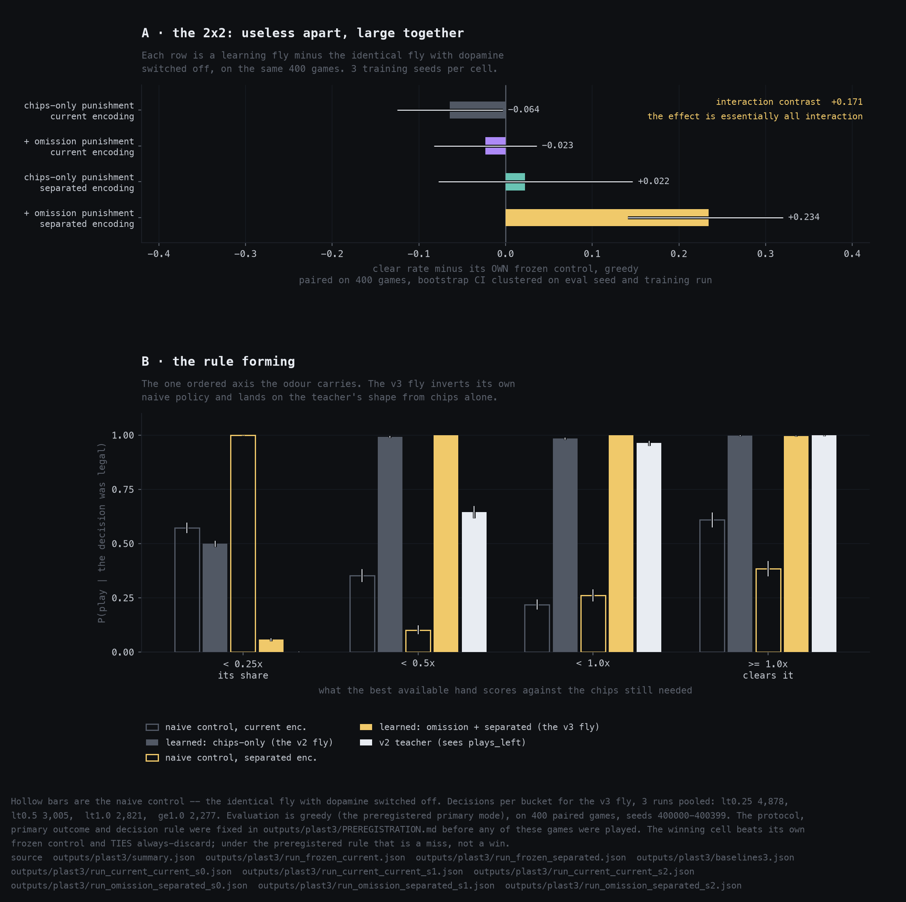
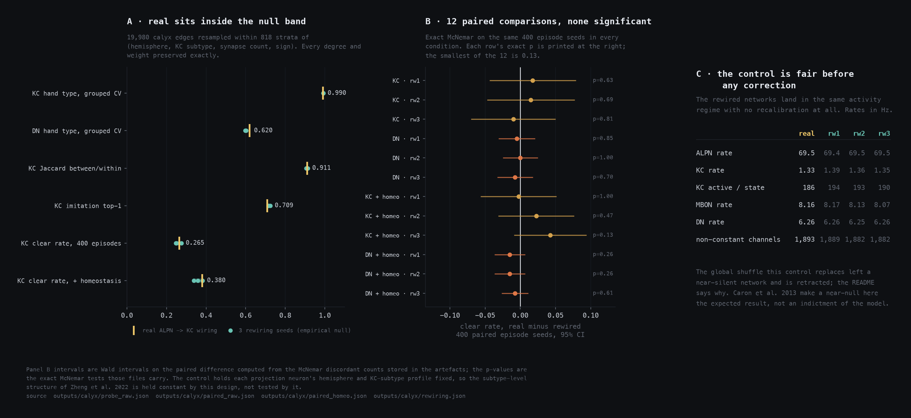

<p align="center">
  
</p>

<p align="center"><sub>
Balatro 1.0.1o, the Steam build, driven by the frozen MaleCNS connectome through a mod. Eight seconds of
the Big Blind in <a href="RESULTS.md#real-game-the-fly-on-actual-balatro-2026-09-13">run 1</a> — it cleared the Small Blind at 384/300 and went on to lose this one at 407/450.
Run 3, not recorded, is the one that cleared ante 1.
</sub></p>

# fly-balatro

The complete male fruit-fly connectome, run as a frozen spiking network, playing
Balatro — with the boundary between the fly and the harness drawn where it
actually is, and every control that would have made the headline smaller run and
reported.

Google and Janelia released **MaleCNS v1.0** — 166,700 neurons, the whole male
*Drosophila* central nervous system — on 2026-09-03, and a wave of "fly brain
plays Doom / Mario 64 / Deadlock" followed. Nearly all of it is a **trained
readout on a frozen spiking simulation**, marketed as though the neurons were
taught something; some of it is scripted. That is a real and interesting thing to
build. It is just not what the caption says.

This is the same genre with the caption fixed, and then pushed until it broke in
ways worth writing down.

---

## The honest boundary

| | |
|---|---|
| **The fly does not see the cards.** | `flybalatro/hands.py` enumerates all 218 subsets of size 1–5 of the dealt hand, classifies and scores each one exactly as the engine does, and picks the best. That is ordinary Python and it is not biological in any sense. |
| **The fly is told an odour.** | The answer becomes 32 binary relay bits, and each bit drives every olfactory receptor neuron of one whole glomerulus — ~6.8 of 32 glomeruli lit per state, 30 mV of tonic drive. That is the entire input. The other 283 state bits are dropped. |
| **The fly is frozen.** | 146,271 brain neurons, 5,146,572 edges at ≥5 synapses, leaky integrate-and-fire with Shiu et al. 2024 constants. One 50 ms window from reset per decision. No weight changes, except on the plasticity path below. |
| **Then one of two things decides.** | **(a)** a trained readout — linear or a 1×256 MLP on log1p spike counts, fitted to 120,755 teacher actions. Or **(b)** no trained action readout at all: the fly's own mushroom-body output neurons, `mean rate(66 approach) − mean rate(24 avoid) + bias`, and dopamine-gated depression of its 33,496 KC→MBON synapses driven by the chips the game pays. |



### What is fitted, what is only calibrated, and what is ours

**"No trained action readout" is not "nothing is fitted."** Dopamine is an
**imposed harness signal** computed from the game's chips, not something the fly
generates, and four quantities on path (b) are calibrated before any learning
starts. None of them sees an action, a label or an outcome; all four are named
again at every claim that depends on them.

| | path | what it is fitted or calibrated to |
|---|---|---|
| **trained action readout** — linear or a 1×256 MLP on log1p spike counts | (a) | **Fitted.** The teacher's chosen action on **120,755** held-in states. Everything it gets right is information that survived the trip through the fly. |
| **decision bias** (−2.616) and **softmax temperature** (0.838) | (b) | Calibrated, **label-free**, from 200 hands before any learning. |
| **4,064 per-Kenyon-cell homeostatic thresholds** | (b) | Calibrated, **label-free**: each cell sees only its own firing rate. |
| **punishment / reward per-pulse gain ratio** (3.81) | (b) | Calibrated, **label-free**, by matching absolute weight change per pulse. |
| **the APL gains, one global conductance, the uniform −45 mV spike threshold** | both | Neither fitted nor measured — **ours**. The connectome gives topology, synapse counts and a predicted sign per neuron; it does not give per-synapse efficacy or spike thresholds. Listed in [`outputs/mb/REPORT.md`](outputs/mb/REPORT.md) §1. |
| **the 5,146,572 connectome edges themselves** | both | **Frozen.** Nothing moves on path (a) at all; on path (b) only the 33,496 KC→MBON weights move, under dopamine-gated depression. |

---

## Headline results, with their controls

Every row is a 400-episode ante-1 evaluation on shared seeds unless stated.

| | result | the control beside it |
|---|---|---|
| **The fly plays real Balatro** | 3 runs, **6 of 9 blinds cleared**, ante 1 cleared in run 3, **zero rejected API calls** | 3 runs is an existence proof, not a rate. No comparison with the headless number is claimed. |
| **Ante-1 clear rate, real wiring** (v3, ALPN+KC+DN) | linear **0.378** [0.331, 0.426], MLP **0.395** [0.348, 0.444] | the *same* MLP on the same 32 bits **without the fly**: 0.422. A random projection of those bits, linear: 0.438.   |
| **Plays the best available subset** (v3, real wiring, linear) | **0.810** of plays | the no-brain control on the same bits: 0.841. The fly costs 3 points. Under v2's encoding it was 0.112 against 0.927. |
| **Hand type decodable from Kenyon cells** | **1.000** (grouped CV 0.995) | chance 0.117; driven-ORN-count-only confound 0.267. The old encoding's KC probe, on an *easier* binary label, managed 0.598 — a different task, not a controlled comparison. |
| **…at the descending neurons** | **0.842** | but the DN *intensity* probe is 0.918 — DNs still carry how much more cleanly than what |
| **Does evolved calyx wiring help?** | **No.** `real` sits inside the 3-seed rewired null on every measure | 12 paired comparisons, smallest exact-McNemar p = **0.13**. Agrees with Caron et al. 2013. |
| **Does the fly's own learning rule learn?** | **Yes: +0.234** [+0.141, +0.320] over its own frozen control | and it **ties** always-discard: +0.024 [−0.072, +0.113]. Preregistered rule required beating both. **That is a miss.** |
| Label-free recalibration, for scale | per-KC homeostatic thresholds move clear rate 0.265 → **0.380** | in every wiring condition equally. Calibration matters more than wiring here. |

Two claims that were **retracted** rather than quietly dropped, and one bug that
is upstream's:

* **"Real wiring beats shuffled" is retracted.** Under the glomerular encoding a
  global degree-preserving shuffle destroys the convergence the encoding depends
  on and leaves a near-silent network — it compares a working brain against a
  dead one. The [calyx control](#4-the-evolved-calyx-wiring-does-not-help)
  replaces it and answers the other way.
* **"The fly brain garbles its input" was an artefact of the encoding**, not a
  property of the fly. See [below](#1-the-encoding-reversal).
* The `balatro-rs` action mask offered an action its own handler rejected, about
  1 episode in 3,000. Fixed in `patches/balatro-rs.patch`, and we think it should
  go upstream.

---

## The findings

### 1. The encoding reversal

The first version gave each input bit 10 randomly scattered receptor neurons, so
~36 active bits drove ~360 receptors into **all 54 glomeruli on every input** and
the total antennal-lobe spike count varied by a CV of 0.031. Under that encoding
identity died one synapse in: ALPN 0.705, Kenyon cells 0.598, descending neurons
0.605 against a 0.593 majority floor — and the *same* DN spikes decoded "how many
bits are on" at 0.728. The obvious reading was that the fly destroys what you
give it.

It was the input. One relay bit = one whole ORN type, ~6.8 lit per state, and
hand identity survives to Kenyon cells at **1.000** (grouped by relay pattern,
0.995) and descending neurons at **0.842**, with the count-only confound at 0.267.



→ [RESULTS.md § Glomerular encoding](RESULTS.md#glomerular-encoding-2026-09-13) ·
full write-up [`outputs/mb2/REPORT.md`](outputs/mb2/REPORT.md) ·
prior round [`outputs/mb/REPORT.md`](outputs/mb/REPORT.md)

### 2. Behaviour cloning: what survives the trip

Same states, same teacher, byte-identical episode split, same evaluation seeds
across v2 and v3 — only the encoding and the brain's calibration change.

Under v2, every real-wiring readout cleared **0 of 400 episodes** and found the
best available subset on 11 % of plays, where the same readout without the brain
found it on 93 %. Under v3 the best real-wiring readout clears **37.8 %** and
finds the best subset on **81 %**, against a no-brain control at 84 %. The
remaining gap is 3 points.

Read the **linear** column: at the MLP every condition is within 0.017 of the
32-bit input's ceiling, so the MLP column is saturated and cannot separate
wirings at all.



→ [RESULTS.md § v2](RESULTS.md#v2-hand-type-relay-2026-09-13) ·
[§ v3](RESULTS.md#v3-glomerular-encoding-2026-09-13)

### 3. Plasticity: the fly's own rule, and what it actually learned

No trained action readout, no teacher. The decision comes out of the
mushroom-body output neurons by a fixed neurotransmitter-assigned valence rule,
and the only mutable thing in the fly is the weight of its 33,496 KC→MBON
synapses under dopamine-gated depression driven by chips.

Three rounds, and the frozen control is bit-identical every time — 0 of 33,496
synapses move — so the learning effect is real:

* **v1** learned "always play", which is the worst policy in the game. Clear rate
  0.350 → 0.033.
* **v2** added per-Kenyon-cell homeostatic thresholds. This is the one
  intervention that made credit assignment odour-specific (reward specificity
  15 % → 71 %) and it worked: the fly learned the right *shape* — cell-by-cell
  correlation with what the situation deserves went −0.065 → **+0.881** — without
  converting it into wins.
* **v3** was **preregistered** ([`outputs/plast3/PREREGISTRATION.md`](outputs/plast3/PREREGISTRATION.md),
  written before a single game was played) as a 2×2: punish every play that fell
  short of its fair share, × give the score bucket its own disjoint glomerulus
  ensembles. **The two factors are useless apart and large together** —
  −0.023 and +0.022 alone, **+0.234** together, an interaction contrast of +0.171.

And then it stopped, exactly at the optimum of its own reward function. The
dopamine ledger says so: the `< 0.5×` bucket comes out net reward-positive
(139 rewards against 97 punishments), so the reward *tells* the fly to play it,
and the fly obeys. Two of three runs reproduce a hand-written baseline's 400 game
outcomes **bit for bit**. The failure is in the reward specification, not in the
learning.



→ [RESULTS.md § Plasticity](RESULTS.md#plasticity-does-the-flys-own-learning-rule-learn-balatro-from-chips-2026-09-13) ·
[§ v2](RESULTS.md#plasticity-v2-kc-homeostasis-2026-09-13) ·
[§ v3](RESULTS.md#plasticity-v3-the-audit-fixes-and-a-preregistered-2x2-2026-09-13) ·
[`outputs/plast/REPORT.md`](outputs/plast/REPORT.md) ·
[`outputs/plast2/REPORT.md`](outputs/plast2/REPORT.md)

### 4. The evolved calyx wiring does not help

The project's central claim used to be that evolved wiring beats a shuffle. That
control broke, so it was replaced with a narrow one: rewire **one stage** —
19,980 ALPN→Kenyon-cell edges — swapping endpoints within 818 strata of
(hemisphere, KC subtype, synapse count, sign), so every in-degree, out-degree,
in-weight, out-weight and per-projection-neuron subtype profile is preserved
exactly.

Two things make it worth more than the control it replaces. The harness
reproduces `outputs/bc3` **bit for bit** when the rewiring is absent, so nothing
is absorbing the effect; and unlike the global shuffle, the rewired networks land
in the same activity regime **with no recalibration at all**. `real` then sits
inside the three-seed null band on decoding, on Kenyon-cell code structure, on
imitation and on live clear rate — below all three on KC imitation — and none of
the twelve paired comparisons is significant.

Caron et al. 2013 report PN→KC connectivity in *Drosophila* as largely random
with respect to glomerular identity. A near-null here **agrees with the biology**;
a large effect would have been the surprise.



→ [RESULTS.md § Calyx rewiring control](RESULTS.md#calyx-rewiring-control) ·
full write-up [`outputs/calyx/REPORT.md`](outputs/calyx/REPORT.md)

### 5. Two defects in the model this whole genre uses

Both found here, both load-bearing for anyone building the same thing:

* **Fly photoreceptors are histaminergic, i.e. inhibitory.** In a simulation with
  no background activity, the eyes therefore emit *nothing* downstream — a visual
  "fly brain plays X" is, without some fix, driving a dark network. (`doomfly`
  works around it with a tonic 12 mV lamina bias.) Driving the excitatory
  optic-lobe cells instead lands in the same regime as everything else: DN
  identity 0.60/0.54, intensity 0.67.
* **The standard sugar→MN9 sanity check fails on specificity**, before any tuning
  of ours: labellar-bristle gustatory neurons give MN9 1.2–3.2 spikes against
  4.0–6.0 for 165 matched random ORNs. Whatever that check is showing, it is not
  a sugar-specific pathway in this model. (MaleCNS v1.0 also carries no "sugar",
  "Gr64" or "Gr5" annotation string at all.)

→ [RESULTS.md § Gate probe](RESULTS.md#fly-brain-plays-balatro--results-2026-09-12) ·
[`outputs/mb/REPORT.md`](outputs/mb/REPORT.md) §2 ·
[`outputs/mb2/REPORT.md`](outputs/mb2/REPORT.md)

---

## What this is not

* **It is not a fly learning poker.** The poker is solved outside the brain in
  ordinary Python and relayed in as an odour. Every number here measures how much
  of that relay survives the trip, or what the fly's own valence rule does with
  it once it has arrived.
* **It is not evidence that the connectome computes.** On the one stage tested
  properly, its individual wiring contributes nothing measurable — and a
  label-free recalibration of excitability moves the clear rate further (0.265 →
  0.380) than any wiring manipulation did.
* **It is not a simulation of a fly.** The connectome gives topology, synapse
  counts and a predicted sign. It does not give per-synapse efficacy, receptor
  identity, input resistance or spike threshold. One global conductance, a
  uniform −45 mV threshold and a handful of APL gains are ours, not data. They
  are listed in [`outputs/mb/REPORT.md`](outputs/mb/REPORT.md) §1.
* **It is not a benchmark.** Ante 1 only, no jokers, no enhancements, one
  connectome, one window length, one teacher. Three real-game runs.
* **It is not statistically powerful everywhere.** 400 episodes does not separate
  39.5 % from 40.5 %; 3 real-game runs separate nothing. Where an interval is not
  reported, assume it would cross zero.
* **The overlay's Lua side has never executed.** ~120 lines were written,
  installed and unit-tested against real pixels, but a Lua file is only read when
  the game launches and the game has not launched since.
  [`docs/POV.md`](docs/POV.md) §3 is explicit about which half is verified.

---

## Layout

```
flybalatro/         the library: connectome loader, LIF brain, encodings,
                    hand analysis, plasticity, the viewer, the real-game driver
scripts/            one file per experiment stage; every one has a --help that
                    states the protocol it implements
tests/              428 tests, 1 skipped (a v1-era assertion that a brain
                    readout does NOT exist; one does, so it cannot run)
outputs/            every artefact, with the config that produced it, plus five
                    long-form REPORT.md write-ups
figures/            regenerated from outputs/ by scripts/figures.py
patches/            our changes to two upstream projects, with upstream commits
docs/               REPRODUCE, DATA, REALGAME_INSTALL, POV
RESULTS.md          the running lab notebook, in the order things happened,
                    corrections marked in place
```

`RESULTS.md` is the primary record. Corrections to it are made **in place and
marked**, not by deletion — the Plasticity v1 and v2 sections carry the audit
that overturned three of their own claims.

## Reproducing

**[`docs/REPRODUCE.md`](docs/REPRODUCE.md)** goes from clone to every headline
number: the connectome download, building the patched engine, the probes, the
behaviour-cloning pipeline, the plasticity protocol and the calyx control — with
measured runtimes on the machine it was all produced on (M2 Pro, 16 GB) and a
note on which steps need the real game.

```bash
python3.11 -m venv .venv && source .venv/bin/activate
pip install -e ".[viewer,figures,dev]"
python -m pytest                      # 466 passed, 1 skipped, ~36 s
python -m scripts.figures             # redraws every figure from outputs/
python -m flybalatro.viewer.server --port 8767 --policy brain
```

The live dashboard is what most of the debugging happened in; it is also the
project's least dishonest demo, because it labels the relayed hand analysis
"computed outside the brain" on screen. `outputs/pov/dashboard_embedded.png` is
what it looks like with the real game embedded in it.

* [`docs/DATA.md`](docs/DATA.md) — MaleCNS v1.0 provenance, the exact files, and
  what this project filters out of them before anything runs.
* [`docs/REALGAME_INSTALL.md`](docs/REALGAME_INSTALL.md) — driving the Steam
  build (macOS). The only part that cannot be reproduced headlessly.
* [`patches/README.md`](patches/README.md) — the two patched upstreams, pinned
  commits, and why one of the three patches is a real engine bug.

## Licence

MIT, see [`LICENSE`](LICENSE). Chosen to match the vendored upstreams, which
are MIT themselves (`balatro-rs`, `balatrobot`), so the patches in
[`patches/`](patches/) carry the same terms as the code they apply to.

No connectome data and no Balatro asset is redistributed here — see
[`docs/DATA.md`](docs/DATA.md) for the terms that attach to what you download
yourself.

Absolute paths in the artifacts under `outputs/` were redacted before the
first public commit: the author's home directory is written as `<repo>` and
`<home>`. Only the path prefix changed; no measurement, count or result was
touched, and every JSON still parses.

## Citing

[`CITATION.cff`](CITATION.cff). If you cite the connectome, cite the *Cell*
paper at doi:10.1016/j.cell.2026.08.015 and take its canonical author list from
the publisher record.
